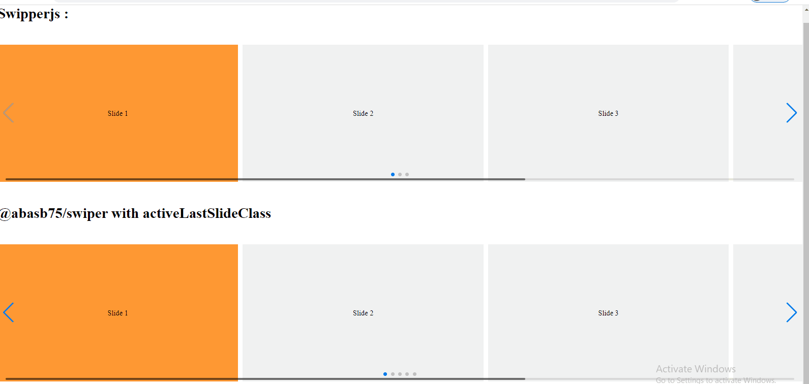

<p>@abasb5/swiper :</p>
<p>this is a fork from : <a href="https://github.com/nolimits4web/swiper" >Swiper Js</a></p>

<p><b>Note :</b>this repository just worked for ReactJs</p>

<p>You can read swiperjs documentation <a href="https://swiperjs.com/react">here</a></p>

<p><b>What is the diffirence?</b></p>

<p>
  
</p>

<p>in swiperjs <code>slidesPerView='auto'</code> props causes the class to not be activated for the last slides. <code>@abasb7/swiper</code> solves this problem with passing <code>activeLastSlideClass={true}</code> as a props!</p>


```javascript

<Swiper
  activeLastSlideClass={true}
  ....
 >
   <SwiperSlide>Slide 1</SwiperSlide>
   <SwiperSlide>Slide 2</SwiperSlide>
   ...
</Swiper>
      
      
```

<p><b>Note:</b> whitout <code>activeLastSlideClass={true}</code> props , there are no diffirence with th original swiperjs</p>


<p>for use in the react projec:
